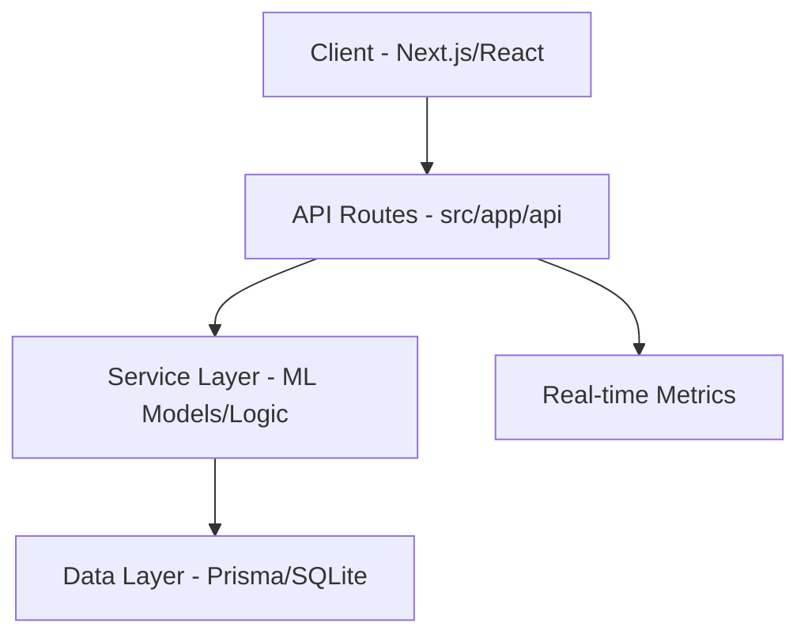

# DZinsights


DZinsights is a high-performance Business Intelligence (BI) platform tailored for the Algerian e-commerce market. It provides real-time predictive analytics, demand forecasting, and customer intelligence driven by advanced Machine Learning models.

##  Key Features

- **Revenue Forecasting**: Time-series predictions using LSTM and ARIMA models to anticipate sales trends.
- **Stock Intelligence**: Inventory optimization to reduce stockouts and unsold products.
- **Customer Intelligence**: Detailed RFM analysis (Recency, Frequency, Monetary) and churn prediction for over 300K customers.
- **Sentiment Analysis**: NLP-driven insights from customer reviews and feedback.
- **Anomaly Detection**: Real-time identification of transactional or operational outliers.
- **Model Registry**: Performance monitoring and tracking for all deployed ML models.

## Tech Stack

- **Frontend**: Next.js 16 (App Router), React 19, Tailwind CSS.
- **UI Components**: Shadcn UI, Radix UI, Framer Motion.
- **Data Visualization**: D3.js, Recharts.
- **Database**: SQLite (via Prisma ORM).
- **Runtime**: Bun.
- **Icons**: Lucide React.

##  Installation & Setup

Ensure you have [Bun](https://bun.sh/) installed.

1. **Clone the repository**:
   ```bash
   git clone 
   cd DZinsights
   ```

2. **Install dependencies**:
   ```bash
   bun install
   ```

3. **Database Setup**:
   ```bash
   bun run db:push
   ```

4. **Start Development Server**:
   ```bash
   bun run dev
   ```

Open [http://localhost:3000](http://localhost:3000) to view the application.

## Project Architecture



- **`src/app`**: Contains all page routes and API endpoints. 
- **`src/components`**: Modular UI components organized by layout, pages, and atomic UI elements.
- **`src/hooks`**: Custom React hooks for global state and side effects.
- **`src/lib`**: Shared utility functions and database configuration.
- **`src/types`**: Centralized TypeScript definitions and interfaces.

## Workflow

1. **Data Ingestion**: Transactions and customer interactions are recorded in the SQLite database.
2. **Analysis**: API routes trigger analysis logic (simulated with ML models) to generate insights.
3. **Visualization**: The frontend fetches processed data and renders dynamic charts using D3.js and Recharts.
4. **Action**: Users monitor KPIs via the dashboard to make informed business decisions.

## License

This project is licensed under the MIT License - see the [LICENSE](LICENSE) file for details.

---
*Developed by Selma Haci*
